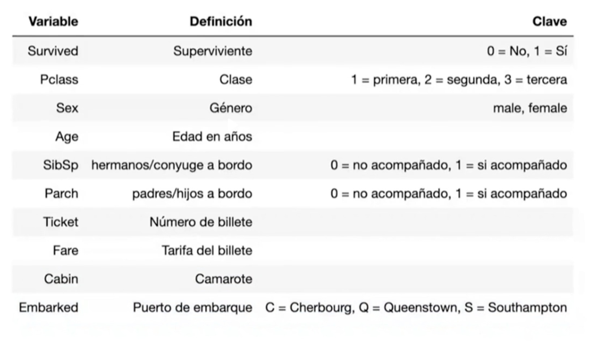

<!DOCTYPE html>
<html lang="es">
<head>
    <meta charset="UTF-8">
    <meta name="viewport" content="width=device-width, initial-scale=1.0">
</head>
<body>
    <h1>Análisis del Conjunto de Datos del Titanic 🚢</h1>
    
El conjunto de datos del Titanic contiene información detallada sobre los pasajeros del trágico viaje del RMS Titanic en 1912. Este análisis nos permitirá explorar diversos aspectos relacionados con la supervivencia de los pasajeros y cómo diferentes variables influyeron en las tasas de supervivencia. A continuación, se presenta una descripción de las variables más comunes en este conjunto de datos:

    <ul>
        <li><strong>PassengerId</strong>: Identificador único para cada pasajero.</li>
        <li><strong>Survived</strong>: Indica si el pasajero sobrevivió al hundimiento (0 = No, 1 = Sí).</li>
        <li><strong>Pclass</strong>: Clase de viaje del pasajero (1 = Primera, 2 = Segunda, 3 = Tercera).</li>
        <li><strong>Name</strong>: Nombre del pasajero.</li>
        <li><strong>Sex</strong>: Género del pasajero.</li>
        <li><strong>Age</strong>: Edad del pasajero (algunos valores pueden estar faltantes).</li>
        <li><strong>SibSp</strong>: Número de hermanos/esposas a bordo.</li>
        <li><strong>Parch</strong>: Número de padres/hijos a bordo.</li>
        <li><strong>Ticket</strong>: Número de boleto del pasajero.</li>
        <li><strong>Fare</strong>: Tarifa de pasaje pagada.</li>
        <li><strong>Cabin</strong>: Número de camarote (muchos valores faltantes).</li>
        <li><strong>Embarked</strong>: Puerto de embarque (C = Cherbourg, Q = Queenstown, S = Southampton).</li>
    </ul>
    
Este conjunto de datos es ideal para explorar temas como la supervivencia de los pasajeros en relación con su clase, edad, género y otras características.

    <h2>Contenido del Repositorio:</h2>
    
    <ul>
        <li><strong>Análisis Exploratorio de Datos y Técnicas de Extracción de Características</strong></li>
        <li><strong>Visualización de Datos</strong></li>
        <li><strong>Como imputar Dato Faltantes</strong></li>
        <li><strong>Selección de Características</strong></li>
    </ul>
    <h2>Exploración del DataSet</h2>
    
    <h3>Cómo Utilizar Este Repositorio:</h3>
    <ol>
        <li><strong>Clona este repositorio en tu máquina local</strong>:
            <pre><code>git clone https://github.com/tu_usuario/titanic-dataset-analysis.git</code></pre>
        </li>
        <li><strong>Abre el Jupyter Notebook en tu entorno de trabajo de Python</strong>:
            <pre><code>jupyter notebook</code></pre>
        </li>
        <li><strong>Sigue las instrucciones y ejecuta las celdas de código paso a paso</strong> para comprender los conceptos y técnicas presentadas.</li>
        <li><strong>Experimenta con el código y los datos por tu cuenta</strong> para obtener una comprensión más profunda.</li>
    </ol>
    
Se utilizan las librerías <strong>pandas</strong>, <strong>numpy</strong>, <strong>matplotlib</strong> y <strong>seaborn</strong> para el análisis y la visualización de los datos. Se realizan gráficos para mejorar la visualización del análisis.

    
Si te gusta este repositorio, puedes mostrar tu apoyo haciendo clic en el botón ⭐️ y compartiéndolo. 🦄

    
👩‍💻 ¡Muchas gracias y saludos!

</body>
</html>
